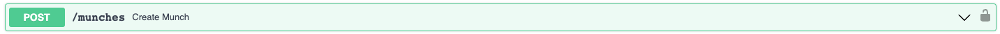
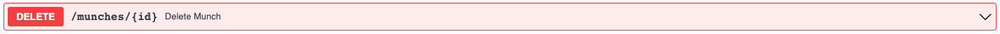
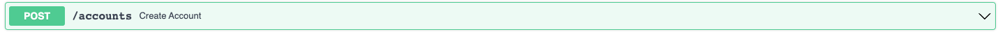
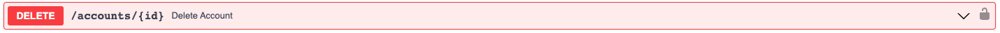

# APIs

## Munches

 
 
JSON Request Body:

`{
  "location": "string",
  "rating": 0,
  "review": "string",
  "photo": "string",
  "tag": true,
  "city": "string",
  "state": "string",
  "user_id": "string"
}`
 
 
Returns (Status Code 200):

`{
  "id": 0,
  "location": "string",
  "rating": 0,
  "review": "string",
  "photo": "string",
  "tag": true,
  "city": "string",
  "state": "string",
  "user_id": "string"
}`
 
 

 
 
Returns (Status Code 200):

`[
  {
    "id": 0,
    "location": "string",
    "rating": 0,
    "review": "string",
    "photo": "string",
    "tag": true,
    "city": "string",
    "state": "string",
    "user_id": "string"
  }
]`
 
 

 
 
Returns (Status Code 200):

`{
  "id": 0,
  "location": "string",
  "rating": 0,
  "review": "string",
  "photo": "string",
  "tag": true,
  "city": "string",
  "state": "string",
  "user_id": "string"
}`
 
 

 
 
JSON Request Body:

`{
  "location": "string",
  "rating": 0,
  "review": "string",
  "photo": "string",
  "tag": true,
  "city": "string",
  "state": "string",
  "user_id": "string"
}`
 
 
Returns (Status Code 200):

`{
  "id": 0,
  "location": "string",
  "rating": 0,
  "review": "string",
  "photo": "string",
  "tag": true,
  "city": "string",
  "state": "string",
  "user_id": "string"
}`
 
 

 
 
Returns (Status Code 200):

`true`

## Accounts

