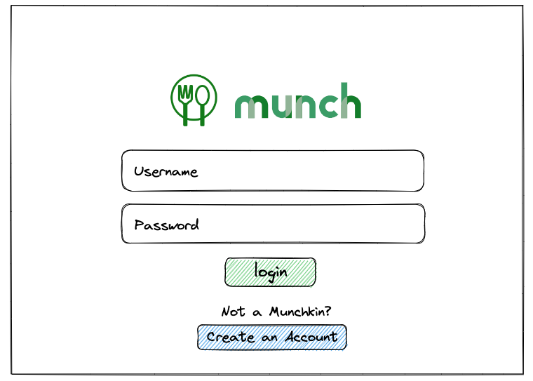
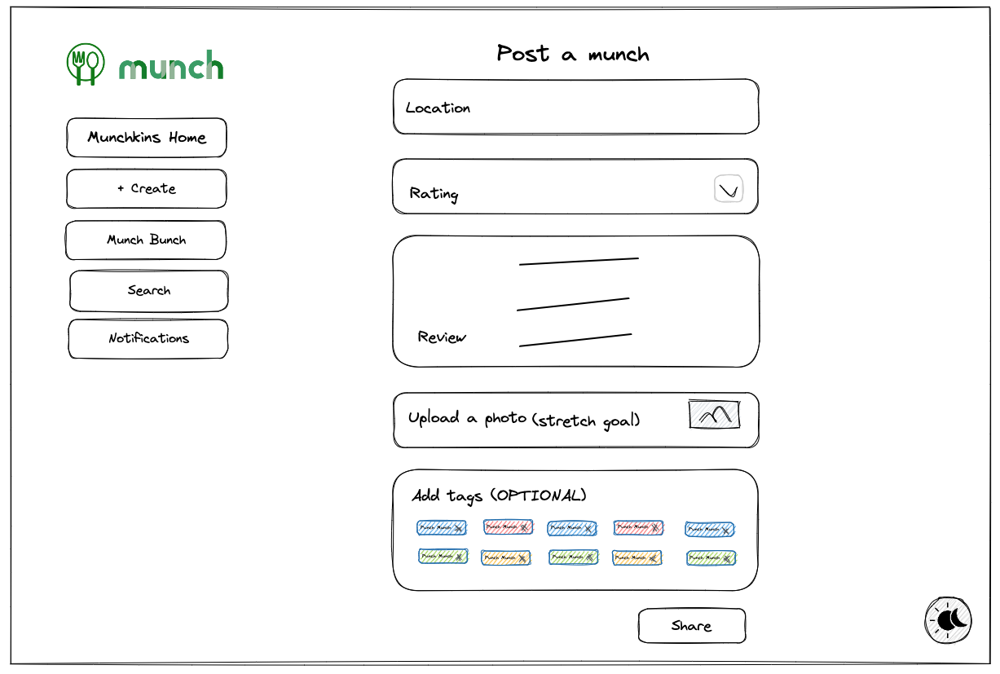
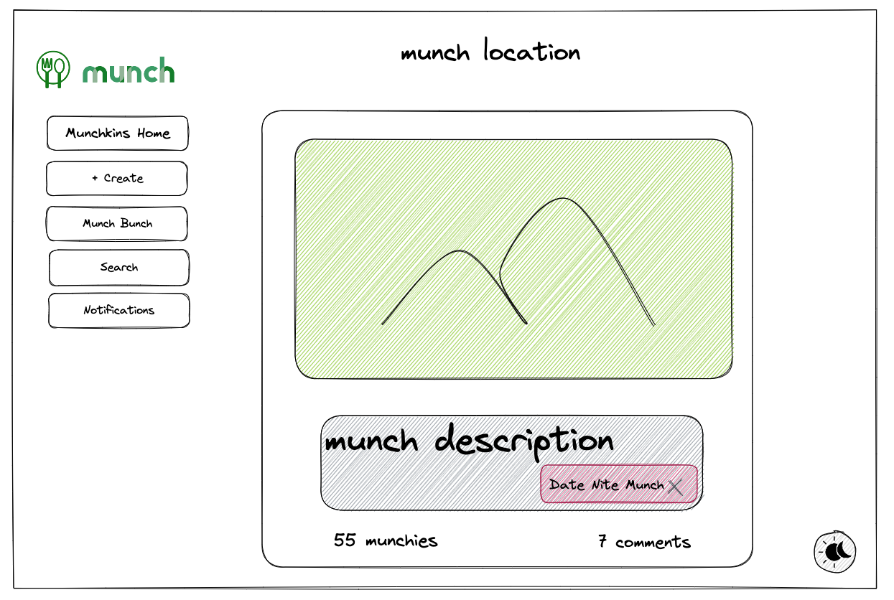
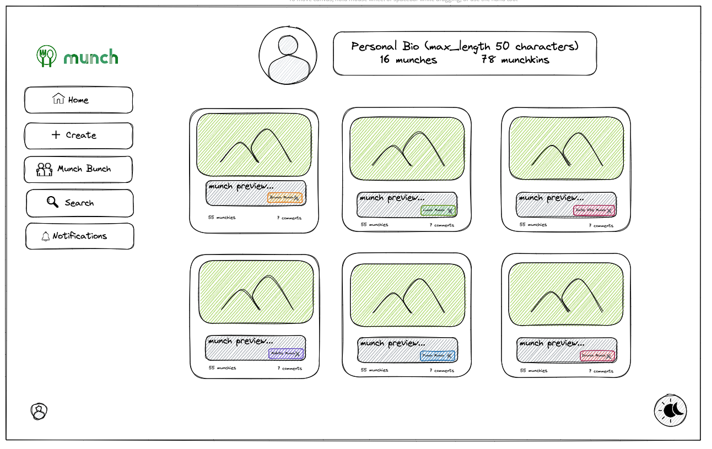

# Wireframes

These are diagrams created during the exploratory phase of the project.

## Sign-up Page

This was intended to be the page a user would utilize to create an account.
 
 

## Log-in Page

This was intended to be the page a user would utilize to log-in to their account.
 
 

## Home Page

This page was intended to be displayed when a user logs-in. It exhibits all munches created by the user. The user could use the left-hand navigation bar to access other available pages.
 
 

## Create Munch Page

This page was intended to allow the logged-in user to create a munch. The munch would then be displayed on the user's Home Page. The user could edit or delete the munch after creating it.
 
 

## Detail Munch Page

This page was intended to allow the logged-in user view the details of one of their existing munches.
 
 

## Edit Munch Page

This page was intended to allow the logged-in user to edit one of their existing munches.
 
 

## Munchkin Profile Page

This page was intended to allow the logged-in user to view the profile and munches of another user.
 
 

## Full Original Wireframe

 
 

